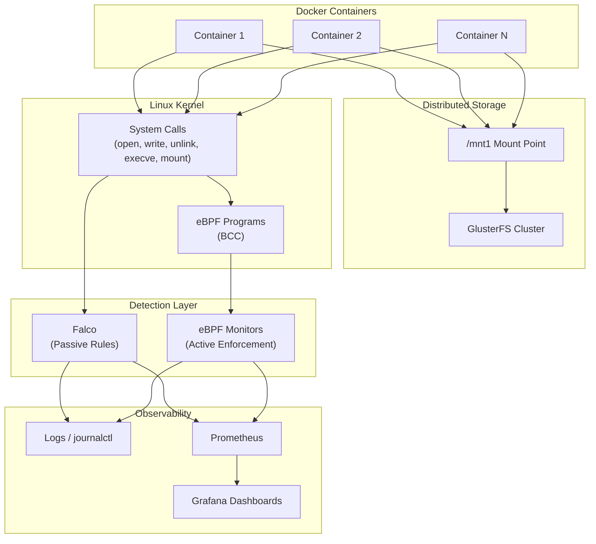
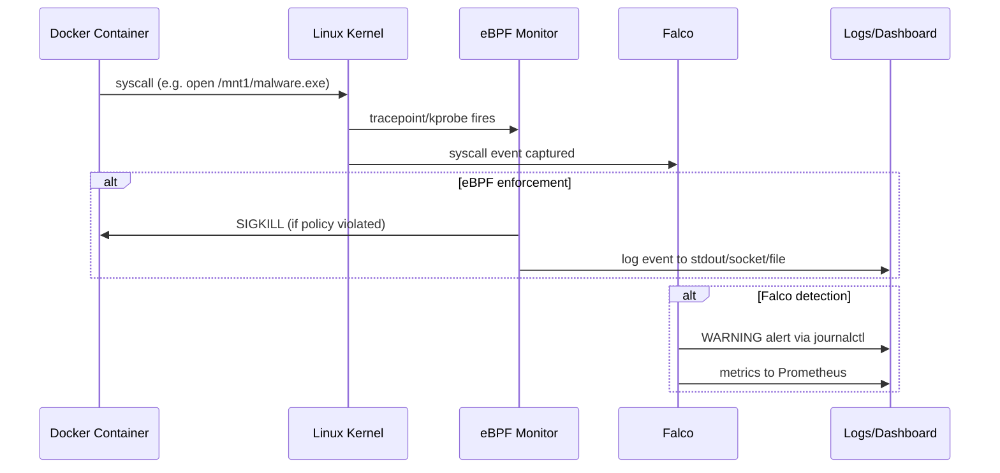

# Architecture

This document describes the system architecture for Docker Security Monitoring in a Distributed File System.

## Overview

The project monitors and enforces security policies on Docker containers that share a GlusterFS distributed filesystem mounted at `/mnt1`. It uses a dual-layer approach: **Falco** for passive detection and alerting, and **eBPF (BCC)** for active kernel-level monitoring and enforcement.

## Architecture Diagram



## Component Layers

### 1. Infrastructure Layer

| Component | Role |
|-----------|------|
| **GlusterFS** | Distributed filesystem; data replicated across nodes |
| **Docker** | Container runtime; containers mount `/mnt1` for shared storage |
| **Linux Kernel** | Provides syscall interface traced by eBPF and Falco |

### 2. Monitoring Layer

#### Falco (Passive Detection)

- YAML rules in `falco_rules/rules.d/`
- Detects suspicious activity and emits alerts
- Does not kill processes by default
- Integrates with Falcosidekick → Prometheus → Grafana

#### eBPF Monitors (Active Enforcement)

- Python + BCC programs in `ebpf/`
- Attach to kernel tracepoints/kprobes
- Some monitors actively kill processes (`SIGKILL`) and delete files
- Run as root; require `bpfcc-tools` and `python3-bpfcc`

### 3. Security Scenarios Covered

| Scenario | Falco Rule | eBPF Monitor |
|----------|------------|--------------|
| Mount point modification (`/mnt1`) | `0_glusterfs_mount_point_modification.yaml` | `glusterfs-monitor-updated.py` |
| Volume operations | `1_glusterfs_volume_operations.yaml` | `glusterfs-volume-monitor.py` |
| Config file access (`/etc/glusterfs`) | `2_glusterfs_config_file_access.yaml` | `glusterfs-config-monitor.py` |
| Service status changes | `3_glusterfs_service_status_change.yaml` | `glusterfs-service-monitor.py` |
| Network connection spikes | `6_glusterfs_network_connection_spike.yaml` | `glusterfs-network-monitor.py` |
| Suspicious file extensions | `7_glusterfs_unusual_file_extension.yaml` | `glusterfs-unusual-file-extension.py` |
| Read-only container writes | `8_detect_readonly_containers_writing.yaml` | `docker_monitoring.py` |
| Restricted downloads (wget/curl) | `9_restricted_download_methods.yaml` | `glusterfs-download-monitor.py` |
| Unauthorized mount attempts | `10_unauthorized_mount.yaml` | `glusterfs-unauthorized-mount.py` |
| Log tampering | `12_detect_glusterfs_log_tampering.yaml` | `glusterfs-log-open.py` |
| File deletions | — | `glusterfs-delete-monitor.py` |
| Large file transfers | — | `glusterfs-large-transfer-monitoring.py` |
| Mass file opens | — | `glusterfs-open-monitor.py` |
| General access monitoring | — | `glusterfs-access-monitoring.py` |

### 4. Data Flow



## Directory Structure

```
Docker-Security-Monitoring/
├── ebpf/                          # eBPF monitoring scripts (BCC/Python)
├── ebpf_shell_scripts/            # Test triggers for eBPF monitors
├── falco_rules/rules.d/           # Falco YAML security rules
├── falco_rules_shell _scripts/    # Test triggers for Falco rules
├── docker/                        # Docker Compose for test containers
├── docs/                          # Architecture and run guides
├── images/                        # Screenshots and diagrams
├── scripts/                       # Validation and utility scripts
├── requirements.txt               # Python dependencies
└── README.md                      # Installation and quick start
```

## Prerequisites

- Ubuntu Linux (tested on 22.04+)
- Root/sudo access (required for eBPF)
- Docker, GlusterFS, Falco installed (see [README](../README.md))
- BCC: `sudo apt install bpfcc-tools python3-bpfcc`
- Python 3.8+ with `docker` and `PyYAML` packages

## Platform Notes

- eBPF syscall hooks in `docker_monitoring.py` use `__x64_sys_*` kprobes (x86_64 only)
- Most other monitors use tracepoints and are architecture-independent
- GlusterFS mount point is hardcoded as `/mnt1` across rules and monitors
